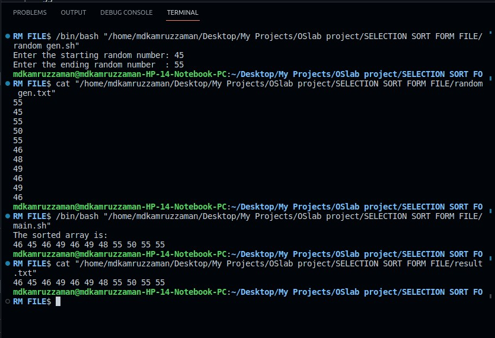

# Shell Programming Mini Projects

## Mini Project 2: Selection Sort

### Aim:
Create a shell program for selection sort, taking input from a file generated by another shell program.

### Algorithm (random_gen.sh):
1. **Start the Program**: Start the program "random_gen.sh".
2. **Input Range**: Read the values of `$start` and `$end` from the terminal.
3. **Generate Random Values**: Generate random values from `$start` to `$end` and save them in a file named "random_gen.txt".
4. **End Program**

### Algorithm (main.sh):
1. **Start the Program**: Start the program "main.sh".
2. **Read Data**: Read values from the file "random_gen.txt" into the array `$dataPline()`.
3. **Sort Data**: Use the selection sort algorithm implemented as a shell program to sort the array.
4. **Save Result**: Save the sorted result into the file "result.txt".
5. **Display Result**: Display the sorted result in the terminal.
6. **End Program**

---

## Repository Structure

- **/Mini_Project_2**: Contains files related to the Selection Sort program.
  - `random_gen.sh`: Shell script for generating random values.
  - `main.sh`: Shell script for selection sort.
  - `random_gen.txt`: File containing randomly generated values.
  - `result.txt`: File containing the sorted result.
  - `README.md`: Documentation for Mini Project 2.

- `README.md`: Main README file providing an overview of both mini projects.

---

Feel free to explore each directory for detailed explanations and code implementation. Happy coding!